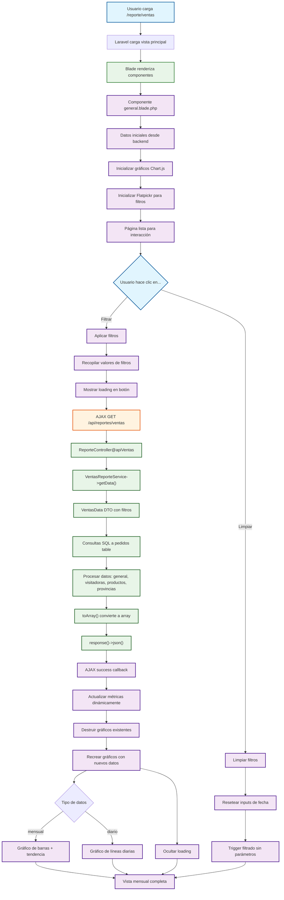

```mermaid
flowchart TD
    %% Inicio del flujo
    A[Usuario carga /reporte/ventas] --> B[Laravel carga vista principal]
    B --> C[Blade renderiza componentes]

    %% Inicialización
    C --> D[Componente general.blade.php]
    D --> E[Datos iniciales desde backend]
    E --> F[Inicializar gráficos Chart.js]
    F --> G[Inicializar Flatpickr para filtros]

    %% Estado inicial listo
    G --> H[Página lista para interacción]

    %% Interacción del usuario
    H --> I{Usuario hace clic en...}

    I -->|Filtrar| J[Aplicar filtros]
    I -->|Limpiar| K[Limpiar filtros]

    %% Proceso de filtrado
    J --> L[Recopilar valores de filtros]
    L --> M[Mostrar loading en botón]
    M --> N["AJAX GET /api/reportes/ventas"]

    %% Backend processing
    N --> O["ReporteController@apiVentas"]
    O --> P["VentasReporteService->getData()"]
    P --> Q["VentasData DTO con filtros"]
    Q --> R["Consultas SQL a pedidos table"]
    R --> S["Procesar datos: general, visitadoras, productos, provincias"]
    S --> T["toArray() convierte a array"]
    T --> U["response()->json()"]

    %% Frontend response handling
    U --> V[AJAX success callback]
    V --> W[Actualizar métricas dinámicamente]
    W --> X[Destruir gráficos existentes]
    X --> Y[Recrear gráficos con nuevos datos]
    Y --> Z[Ocultar loading]

    %% Proceso de limpieza
    K --> AA[Resetear inputs de fecha]
    AA --> BB[Trigger filtrado sin parámetros]

    %% Tipos de visualización
    Y --> CC{Tipo de datos}
    CC -->|mensual| DD[Gráfico de barras + tendencia]
    CC -->|diario| EE[Gráfico de líneas diarias]

    %% Estados finales
    DD --> FF[Vista mensual completa]
    EE --> FF
    Z --> FF
    BB --> FF

    %% Estilos para mejor visualización
    classDef user fill:#e1f5fe,stroke:#01579b,stroke-width:2px
    classDef frontend fill:#f3e5f5,stroke:#4a148c,stroke-width:2px
    classDef backend fill:#e8f5e8,stroke:#1b5e20,stroke-width:2px
    classDef database fill:#fff3e0,stroke:#e65100,stroke-width:2px
    classDef success fill:#e8f5e8,stroke:#2e7d32,stroke-width:2px

    class A,I user
    class D,E,F,G,H,J,K,L,M,V,W,X,Y,Z,AA,BB,DD,EE,FF frontend
    class O,P,Q,R,S,T,U backend
    class N database
    class C success
```